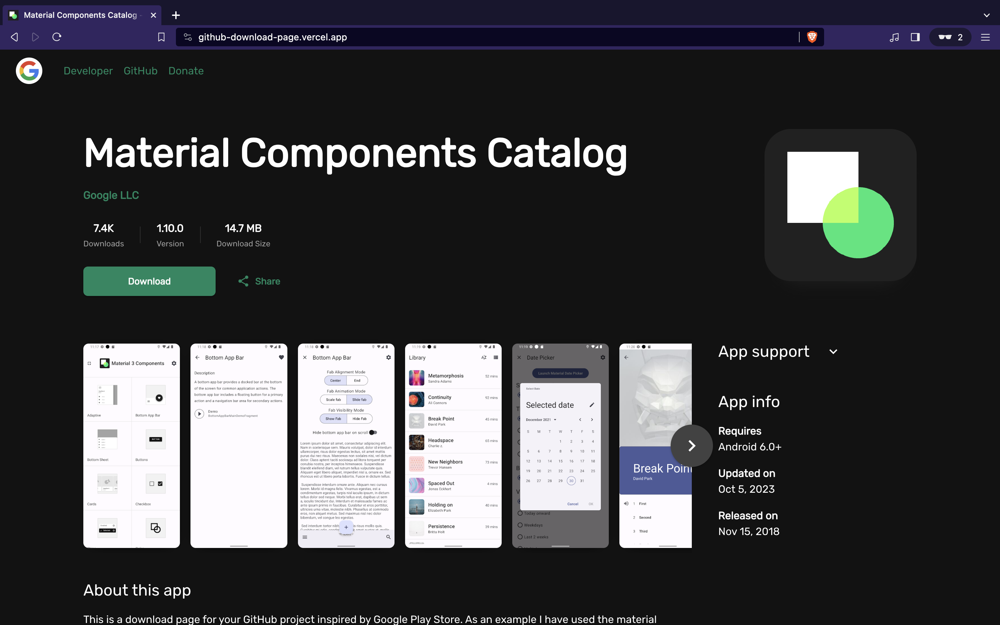

# Github Download Page

 

A beautiful download page for your GitHub project inspired by Google Play Store.



### Installation

This package gives you an [express router](https://expressjs.com/en/5x/api.html#router) in the form of a function, so you'll need to install [express](https://www.npmjs.com/package/express) to use this router.

After this you can install this package using the following command.

```sh
$ npm i therealsujitk/github-download-page#1.0.1
```

### Example

Here's a simple example of an express application that uses this package.

```ts
import express from 'express';
import { downloadPageRouter } from 'github-download-page';

const app = express();
const port = process.env.PORT || 3000;

app.use('/', downloadPageRouter());

app.listen(port, () => {
  console.log(`Server running at http://localhost:${port}`);
});
```

The `downloadPageRouter()` function takes an optional [`SiteConfiguration`](./index.d.ts) argument that you can use to configure your download page. If you have any questions feel free to open an issue and I'll get back to you.
